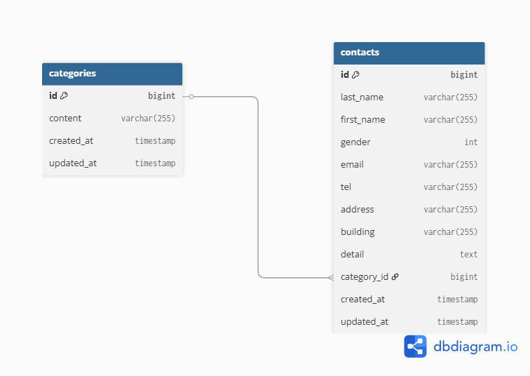

## 環境構築
**Dockerビルド**
1. `git clone git@github.com:towa709/kadaitest.git'
2. DockerDesktopアプリを立ち上げる
3. `docker-compose up -d --build`

**Laravel環境構築**
1. `docker-compose exec php bash`
2. `composer install`
3. '.env.example'ファイルを コピーして'.env'を作成し、DBの設定を変更
``` text
DB_HOST=mysql
DB_DATABASE=laravel_db
DB_USERNAME=laravel_user
DB_PASSWORD=laravel_pass
```
5. アプリケーションキーの作成
``` bash
php artisan key:generate
```

6. マイグレーションの実行
``` bash
php artisan migrate
```
re
7. シーディングの実行
``` bash
php artisan db:seed
```
8.権限付与
 sudo chmod -R 777 src/*

## ER図



## URL
- 開発環境：http://localhost
- phpMyAdmin:：http://localhost:8080